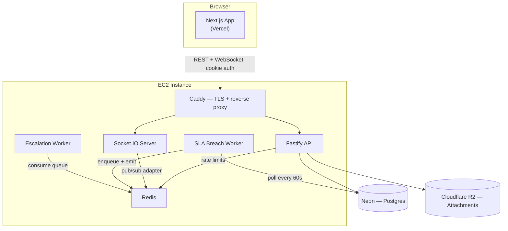
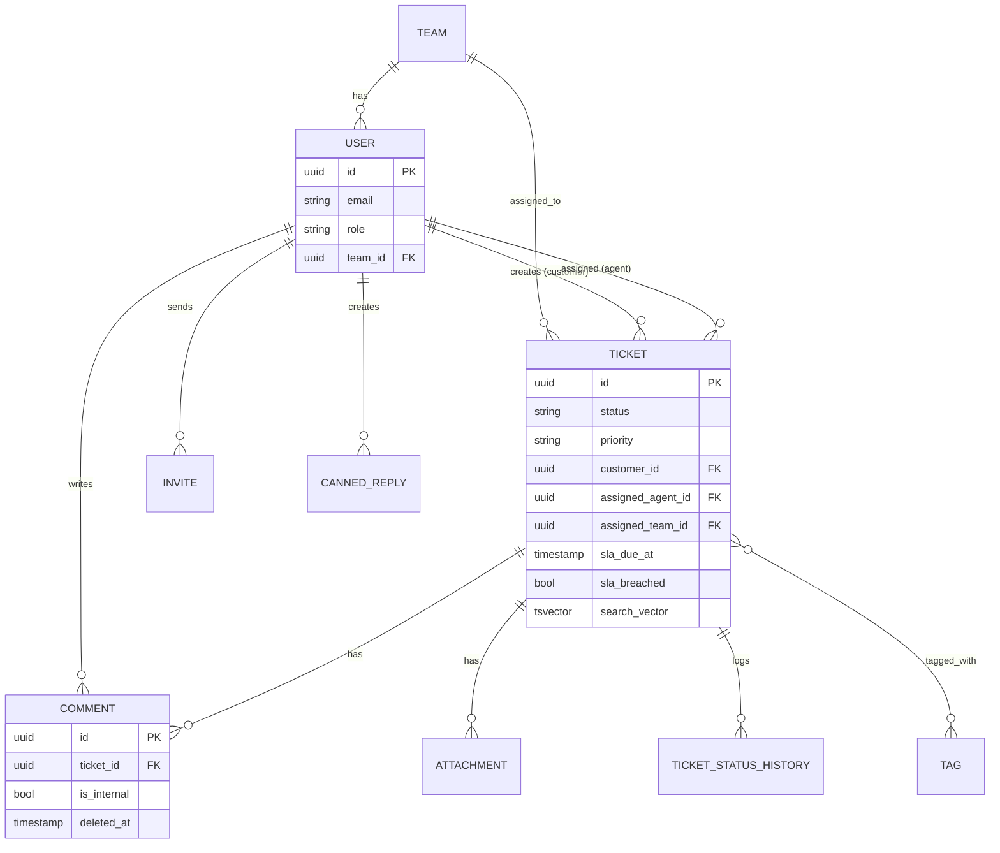
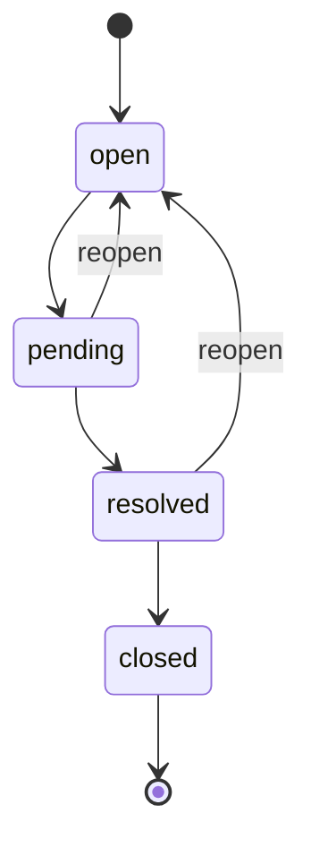
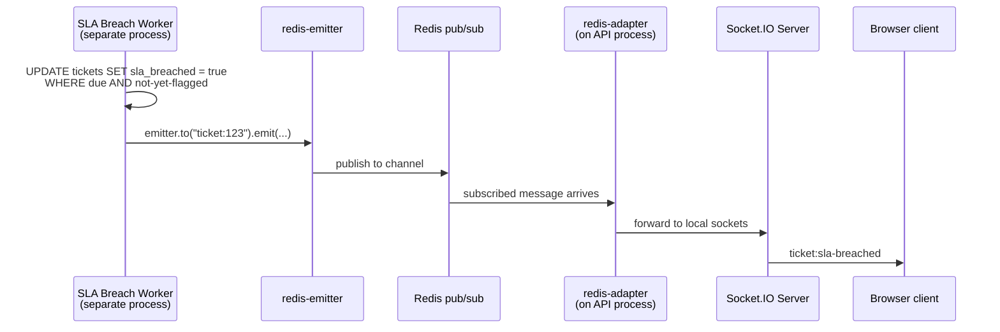
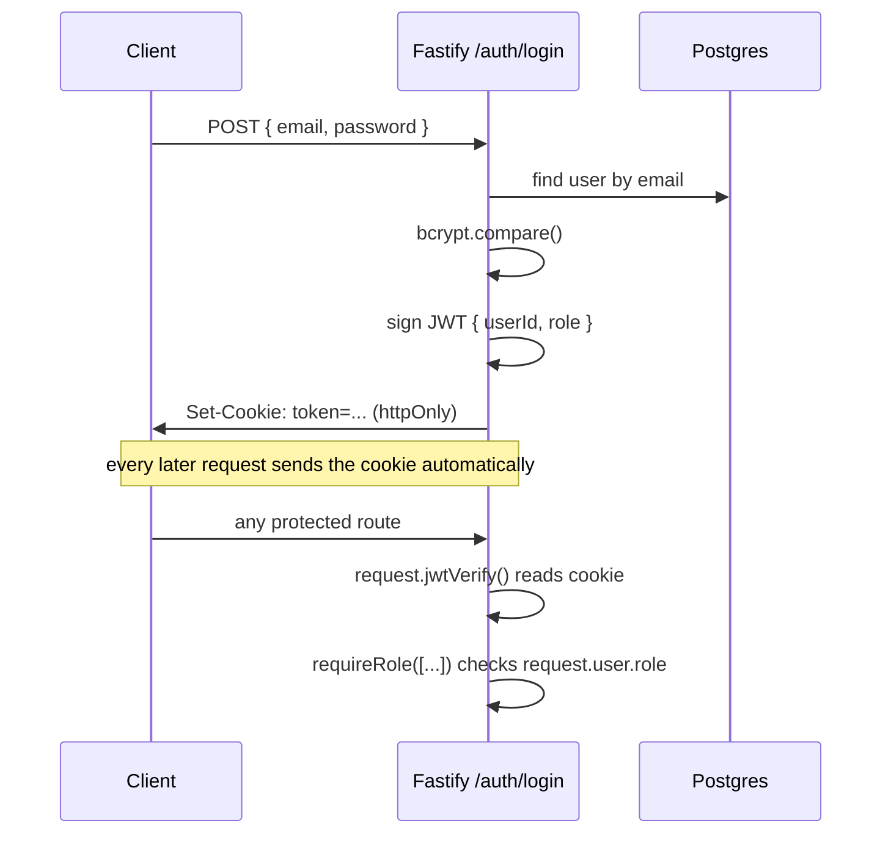
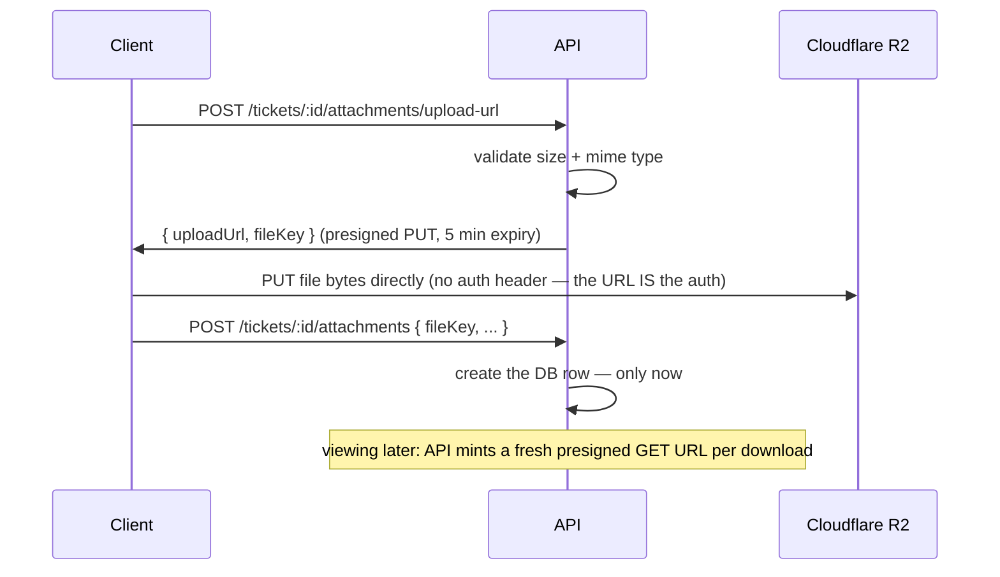

# SLA Desk

A fullstack customer support & SLA ticketing platform. Customers file tickets, agents triage and reply, every ticket carries a priority-derived deadline, and a background worker flags breaches and pushes realtime updates to connected clients.

Built with Next.js, Fastify, PostgreSQL, Redis, and Socket.IO.

> For a full narrative walkthrough of every architectural decision and why it was made, see [`docs/deep-dive.pdf`](./docs/sla-desk-deep-dive.pdf).

---

## Stack

| Layer | Technology |
|---|---|
| Frontend | Next.js (App Router), TanStack Query, Tailwind v4, shadcn/ui |
| Backend | Fastify, Drizzle ORM, Zod |
| Database | PostgreSQL (full-text search via `tsvector` + GIN index) |
| Cache / Queues | Redis, BullMQ |
| Realtime | Socket.IO, Redis pub/sub adapter |
| Storage | Cloudflare R2 (S3-compatible, presigned URLs) |
| Auth | JWT in httpOnly cookies |
| Testing | Vitest (integration), Playwright (E2E) |

---

## Monorepo layout

```
sla-desk/
├── apps/
│   ├── api/            Fastify backend
│   └── web/            Next.js frontend
├── packages/
│   └── shared/         Zod schemas + inferred types — used by BOTH apps
└── docker-compose.yml   Local Postgres + Redis
```

`packages/shared` is the single source of truth for request/response validation and the literal value lists (`TICKET_PRIORITIES`, `TICKET_STATUSES`, etc.). It can never import backend-only code (Drizzle, `pg`) — the dependency direction only ever flows *from* the backend's schema files *into* shared, never the reverse.

### Backend (`apps/api/src`)

```
modules/          one folder per domain: auth, tickets, comments, attachments,
                  invites, teams, tags, canned-replies
  <domain>.routes.ts       HTTP only — parse request, call service, respond
  <domain>.service.ts      business logic, RBAC-at-the-data-level checks
  <domain>.repository.ts   the actual Drizzle queries
db/               schema, relations, migrations
workers/          SLA breach worker + escalation worker — separate processes
realtime/         Socket.IO server, cookie-based auth, room-scoped events
config/           env validation, db/redis/r2 client setup
```

### Frontend (`apps/web`)

```
app/              routes only — no business logic
features/         <domain>/api.ts (plain fetch) + hooks.ts (TanStack Query)
components/       ui/ (shadcn) + shared/ (app-specific)
lib/              api client, query-key factory, formatting helpers
e2e/              Playwright specs
```

---

## Architecture



**Why this split:** Socket.IO needs persistent connections and the workers are long-running loops — both incompatible with serverless compute, so the API lives on a real box (EC2). Postgres sits on Neon since it holds the data that actually matters (backups, PITR). Redis stays on the EC2 box since everything it holds (rate-limit counters, queue state, pub/sub) is safe to lose on restart. R2 over S3 for zero egress fees on a file-heavy feature.

---

## Data model



`assignedAgentId` and `assignedTeamId` are separate nullable columns — a ticket can be routed to a team's queue without yet being claimed by an individual, a state a single "assignee" field couldn't represent.

---

## Ticket status state machine



Every transition is checked against this exact table before being written, and the DB write + audit-log insert (`ticket_status_history`) happen inside one transaction — both succeed or both fail.

---

## Realtime: bridging a background worker to connected clients



The worker has no access to the API process's in-memory Socket.IO instance — they're separate Node processes. `@socket.io/redis-emitter` mimics the `.to(room).emit()` API but writes to Redis; `@socket.io/redis-adapter` on the API side subscribes and forwards to actual connected sockets. Every emit in this codebase happens *after* the triggering database write has committed — never inside the transaction, never speculatively before it.

---

## Auth



httpOnly cookies over localStorage: the token is invisible to JavaScript entirely, so a single XSS vector elsewhere in the dependency tree can't exfiltrate the session. The tradeoff is that the frontend can't synchronously check "am I logged in" — it asks the server via `GET /auth/me`, and CORS needs `credentials: true` with an explicit origin.

Agents are never self-signed-up — an admin issues a single-use, expiring **invite** (separate table from `users`, since an invite represents "permission to become an agent," not an account), and role/email on account creation come from the invite record, never from the accept-invite request body.

---

## The multi-relation fan-out problem

Fetching one ticket needs its comments *and* its attachments — two independent one-to-many relations off the same parent. Joining both in a single flat query produces a cross product (3 comments × 2 attachments = 6 rows), silently duplicating both collections in the aggregated result.

**Wrong:**
```sql
FROM tickets t
LEFT JOIN comments c ON c.ticket_id = t.id
LEFT JOIN attachments a ON a.ticket_id = t.id
-- 3 comments x 2 attachments = 6 rows before any aggregation
```

**Correct — aggregate each relation independently, combine only the results:**
```sql
SELECT t.*,
  COALESCE((SELECT json_agg(c) FROM comments c WHERE c.ticket_id = t.id), '[]') AS comments,
  COALESCE((SELECT json_agg(a) FROM attachments a WHERE a.ticket_id = t.id), '[]') AS attachments
FROM tickets t WHERE t.id = $1;
```

One join is always safe. Two or more independent one-to-manys off the same parent never are — each needs its own correlated subquery.

---

## Security boundaries worth naming explicitly

- **`role` is never accepted from a public request body.** Signup hardcodes `customer`; agent accounts only come from admin-issued invites where the role is stored server-side on the invite record.
- **`isInternal` is enforced twice** — forced to `false` server-side for customer authors regardless of what they send, and filtered at the SQL `WHERE` clause (not in application code) for customer readers.
- **`customerId` on a ticket always comes from the authenticated session**, never the request body — otherwise any customer could create a ticket on behalf of another.
- **Every attachment service function independently re-checks ticket access** (not just the first step of the upload flow), since a client could call `confirmUpload` directly, skipping the URL-request step.

---

## Attachments: presigned uploads



Files never pass through the API server — it only ever issues and validates signed URLs. The DB row is created *after* confirmation, never before, so there's no record pointing at a file that was never actually uploaded.

---

## Local development

```bash
# 1. Start Postgres + Redis
docker compose up -d

# 2. Install dependencies (from the repo root — always root, never a workspace subfolder)
npm install

# 3. Copy env files and fill in real values
cp apps/api/.env.example apps/api/.env
cp apps/web/.env.example apps/web/.env.local

# 4. Run migrations
npm run db:migrate --workspace=api

# 5. Start everything (separate terminals)
npm run dev --workspace=api
npm run dev --workspace=web
npm run worker:sla --workspace=api
npm run worker:escalation --workspace=api
```

## Testing

```bash
npm run test:unit --workspace=api          # pure functions: state machine, SLA calc
npm run test:integration --workspace=api   # real routes against a real test DB, via Fastify's .inject()
npm run test:e2e --workspace=web           # Playwright, real browser, real running stack
```

---

## Known, deliberate simplifications

- **Email-to-ticket ingestion is not implemented** — the original spec explicitly frames this as mockable; real inbound parsing (Postmark/SendGrid webhooks) would be a natural extension, not a gap.
- **Internal comments are broadcast to the same Socket.IO room as public ones.** The REST endpoint filters correctly server-side; the realtime layer currently relies on the frontend not rendering `isInternal` comments to customers. A fully hardened version would split into `ticket:{id}:public` / `:internal` rooms.
- **Saved filters are localStorage-only**, not synced across devices — deliberate scope call given the spec frames this as a nicety, not a named cross-device requirement.
